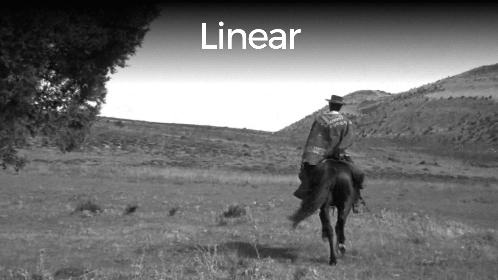

<div align="center" markdown="1">

# PostCSS Easing Gradients

[![Build Status][ci-img]][ci]
[![NPM Version][npm-img]][npm]
[![NPM Monthly Downloads][dm-img]][npm]

</div>

[PostCSS] plugin to create smooth linear-gradients that approximate easing functions.

```css
.demo {
  background: scrim-gradient(
    black,
    transparent
  );

  background: ease-in-out-quad-gradient(
    to bottom left,
    #bada55,
    olive
  );

  background: ease-in-sine-gradient(
    23deg,
    hsla(300, 80%, 50%, 0.7),
    rgb(120, 140, 255)
  );
}
```
becomes
```css
.demo {
  background: linear-gradient(
    hsl(0, 0%, 0%) 0%,
    hsla(0, 0%, 0%, 0.738) 19%,
    hsla(0, 0%, 0%, 0.541) 34%,
    hsla(0, 0%, 0%, 0.382) 47%,
    hsla(0, 0%, 0%, 0.278) 56.5%,
    hsla(0, 0%, 0%, 0.194) 65%,
    hsla(0, 0%, 0%, 0.126) 73%,
    hsla(0, 0%, 0%, 0.075) 80.2%,
    hsla(0, 0%, 0%, 0.042) 86.1%,
    hsla(0, 0%, 0%, 0.021) 91%,
    hsla(0, 0%, 0%, 0.008) 95.2%,
    hsla(0, 0%, 0%, 0.002) 98.2%,
    hsla(0, 0%, 0%, 0) 100%
  );

  background: linear-gradient(
    to bottom left,
    hsl(74.4, 64.3%, 59.4%) 0%,
    hsl(74.2, 63.2%, 58.8%) 9.7%,
    hsl(73.5, 60.7%, 57.1%) 18.3%,
    hsl(72.6, 57.5%, 54.9%) 25.7%,
    hsl(71.5, 54.2%, 52.3%) 32.2%,
    hsl(70.4, 52.1%, 49.6%) 37.9%,
    hsl(69.2, 55.1%, 46.7%) 43.1%,
    hsl(67.9, 58.7%, 43.7%) 47.9%,
    hsl(66.7, 62.8%, 40.6%) 52.4%,
    hsl(65.4, 67.6%, 37.7%) 57.2%,
    hsl(64.2, 72.9%, 34.8%) 62.4%,
    hsl(63, 79%, 32%) 68.2%,
    hsl(61.9, 85.5%, 29.5%) 74.7%,
    hsl(60.9, 92.3%, 27.3%) 82.2%,
    hsl(60.2, 97.8%, 25.7%) 90.9%,
    hsl(60, 100%, 25.1%) 100%
  );


  background: linear-gradient(
    23deg,
    hsla(300, 80%, 50%, 0.7) 0%,
    hsla(299.1, 80.2%, 50.6%, 0.703) 9.7%,
    hsla(296.8, 80.7%, 52.1%, 0.713) 18.9%,
    hsla(293.3, 81.6%, 54.3%, 0.727) 27.4%,
    hsla(289.1, 82.6%, 56.7%, 0.745) 35.2%,
    hsla(284.3, 83.7%, 59.2%, 0.764) 42.5%,
    hsla(279.2, 85%, 61.7%, 0.786) 49.3%,
    hsla(274, 86.4%, 64%, 0.808) 55.7%,
    hsla(268.5, 87.8%, 66.2%, 0.831) 61.8%,
    hsla(263, 89.4%, 68.2%, 0.854) 67.7%,
    hsla(257.4, 91%, 70.1%, 0.878) 73.4%,
    hsla(251.8, 92.7%, 71.8%, 0.902) 78.9%,
    hsla(246.2, 94.4%, 73.4%, 0.927) 84.3%,
    hsla(240.6, 96.2%, 74.9%, 0.951) 89.6%,
    hsla(235.4, 98.3%, 74.3%, 0.976) 94.9%,
    hsl(231.1, 100%, 73.5%) 100%
  );
}
```

## Usage

```js
postcss([ require('postcss-easing-gradients') ])
```
See [PostCSS] docs for examples for your environment.

## Syntax

The syntax is `<gradient-type>([ <direction>,]? <start-color>, <stop-color>)` where
* `gradient-type` is one of the supported gradient types
* `direction` shares syntax with `linear-gradient` and is optional
* `start-color` and `stop-color` are css colors in any format

*Note that it's exactly two colors and it doesn't support custom color stop locations.*

## Supported Gradient Types
```css
ease-in-sine-gradient
ease-out-sine-gradient
ease-in-out-sine-gradient
ease-in-quad-gradient
ease-out-quad-gradient
ease-in-out-quad-gradient
scrim-gradient
```

*Scrim is a custom easing inspired by Material Design text protection scrims*

## Options
* `precision: 0.1` is the default value and creates ~17 color stops. I wouldn't recommending using anything above 0.2 as banding becomes very obvious.
* `alphaDecimals: 3` is the default number of decimals for alpha values and I wouldn't recommend changing it. Increase it for greater precision.

## Preview



## Demo
You can try it out by running `npm install` and `gulp` in the demo folder.

## Contributions
Are more than welcome. Code is linted using:

[![js-standard-style][js-img]][js]


[PostCSS]: https://github.com/postcss/postcss
[ci-img]:  https://img.shields.io/travis/larsenwork/postcss-easing-gradients.svg
[ci]:      https://travis-ci.org/larsenwork/postcss-easing-gradients
[js-img]:  https://cdn.rawgit.com/feross/standard/master/badge.svg
[js]:      https://standardjs.com
[npm-img]: https://img.shields.io/npm/v/postcss-easing-gradients.svg
[npm]:     https://www.npmjs.com/package/postcss-easing-gradients
[dm-img]:  https://img.shields.io/npm/dm/postcss-easing-gradients.svg
